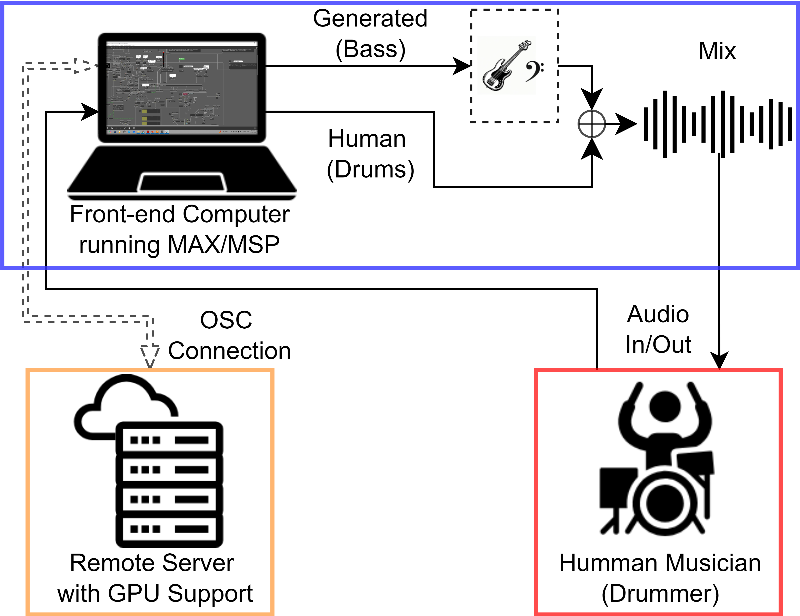
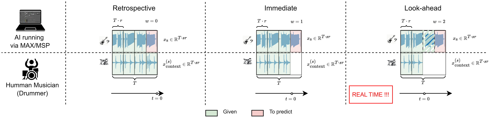
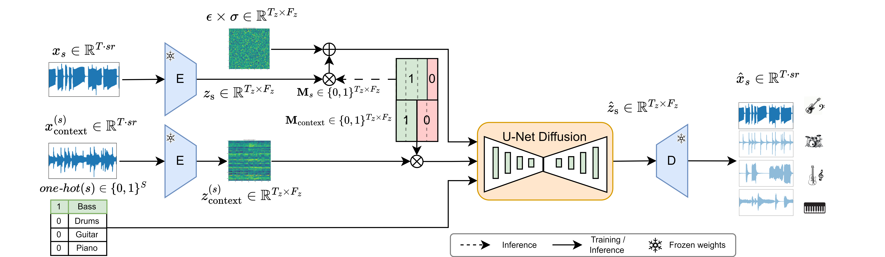

# Towards Real-Time Musical Agents: Instrumental Accompaniment with Latent Diffusion Models and MAX/MSP


This repository contains the official PyTorch implementation accompanying the paper **"Towards Real-Time Musical Agents: Instrumental Accompaniment with Latent Diffusion Models and MAX/MSP"**.


- [arXiv](link here)  
- [Demo Page] [Demo page](https://consistency-separation.github.io/)

**Authors**: Tornike Karchkhadze, Shlomo Dubnov — University of California San Diego

---

## Abstract

We propose a framework for a real-time instrumental accompaniment and improvisation system. The project is twofold: we develop a diffusion-based generative model for musical accompaniment, and build a hybrid system that enables real-time interaction with this model by combining MAX/MSP with a remote Python server. Our latent diffusion model is trained with lookahead conditioning and deployed on a Python server. The MAX/MSP frontend handles real-time audio input, buffering, and playback, and communicates with the server via OSC messages. This setup enables a musician to plug in and play live within MAX/MSP, while the ML model listens and responds with complementary instrumental parts.

---

## System Overview

### Real-Time Sliding-Window Protocol

<p align="center">
  
</p>

---

<p align="center">
  
</p>

Real-time accompaniment is formulated as a sliding-window generation process over a fixed-length context of duration *T*. The window advances by *T·r* at each step, where *r* controls the step size. Three regimes are supported: **retrospective** (w=−1), **immediate** (w=0), and **lookahead** (w=1) prediction.

### Latent Diffusion Model for Accompaniment

<p align="center">
  
</p>

The accompaniment model encodes the input audio mixture into a latent representation via a pre-trained [Music2Latent](https://github.com/SonyCSLParis/music2latent) autoencoder, runs iterative denoising with a U-Net diffusion backbone (~257M parameters), and decodes the result back to audio. For real-time use the model can be run in **inpainting (lookahead) mode**, where partial context is provided as a condition.

### Consistency Distillation for Fast Inference

To meet real-time latency constraints, the diffusion model is distilled into a consistency model (CD). The student is trained to directly map noisy inputs to consistent estimates in 1–2 steps, guided by an EMA teacher and a combined consistency + DSM loss.

---

## Checkpoints

Please contact the authors for checkpoints.

---

## Setup

### 1. Directory Structure

The repo expects two directories at its root:

| Path | Purpose |
|------|---------|
| `dataset/` | Slakh2100 dataset root |
| `lightning_logs/` | Training checkpoints and logs (written by PyTorch Lightning) |


### 2. Dataset

This project uses the [Slakh2100](http://www.slakh.com/) dataset (bass, drums, guitar, piano stems).
Follow the download and setup instructions here:
[We may need to give dataset demo from soemwere bease it is 44100 dataset]

### 3. Conda Environment

This repository uses Python 3.10.

```bash
conda env create -f environment.yaml
conda activate ctm_gen

```

> **Note:** `audioldm_eval` must be installed manually after environment creation (see comment in `environment.yaml`).

---

## Training

### Accompaniment Generation Models (LDM)

**Maskless diffusion model:**
```bash
python train_audio.py --cfg configs/generation/Diff_latent_cond_gen_concat_train.yaml
```

**Masked diffusion model (with lookahead support):**
```bash
python train_audio.py --cfg configs/generation/Diff_latent_cond_gen_concat_inpaint_train.yaml
```

**Maskless consistency distillation model:**
```bash
python main_audio_ctm.py --cfg configs/generation/CD/CD_latent_cond_gen_concat_train.yaml
```

**Masked consistency distillation model (with lookahead support):**
```bash
python main_audio_ctm.py --cfg configs/generation/CD/CD_latent_cond_gen_concat_inpaint_train.yaml
```

## Evaluation

[I will add evaluation run here]


---

## MAX/MSP Integration (Real-Time Server)

`server.py` (diffusion model) and `server_CD.py` (consistency distillation model) expose an OSC interface for real-time integration with MAX/MSP.

Form Max MAX/MSP we will be sending corespoing commands: 

**Run the diffusion server:**
```bash
python server.py --serverport 7000 --clientport 8000 --server_ip <YOUR_SERVER_IP>
```

**Run the CD server:**
```bash
python server_CD.py --serverport 7000 --clientport 8000 --server_ip <YOUR_SERVER_IP>
```

---

## Acknowledgments

This codebase builds upon the following repositories:

- [Sony CTM](https://github.com/sony/ctm)
- [Multi-Source Diffusion Models](https://github.com/gladia-research-group/multi-source-diffusion-models)
- [Audio Diffusion PyTorch (v0.43)](https://github.com/archinetai/audio-diffusion-pytorch)

---

## Citations

If you use this work, please cite:

```bibtex
```
